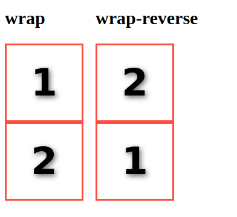
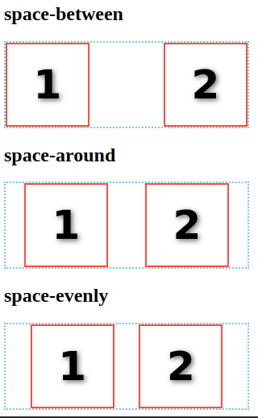
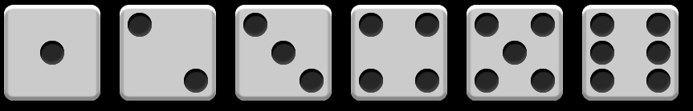
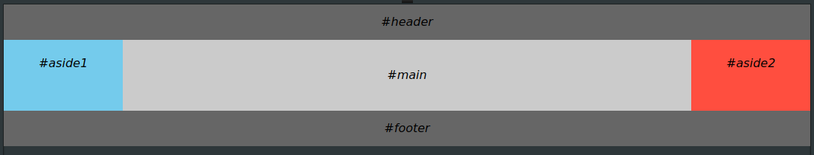
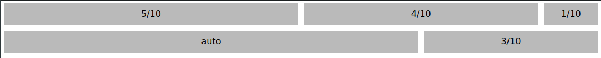
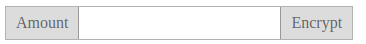

# CSS魔法堂：Flex布局

## 前言
&emsp;Flex是Flexible Box的缩写，就是「弹性布局」。从2012年已经面世，但由于工作环境的原因一直没有详细了解。最近工作忙到头晕脑胀，是要学点新东西刺激一下大脑，打打鸡血。

## Flex就这么简单
### 浏览器兼容性
&emsp;一说到兼容性就是永远的痛，不过幸运的是只要在IE10加`-ms-`前缀就可以用啦^\_^

### 涉及的对象

&emsp;Flex布局主要是操作**Flex Container** 和 **Flex Item**两类对象。<br>
**Flex Container**为作为布局容器拥有__main axis__，__main start__，__main end__，__cross axis__，__cross start__ 和 __cross end__属性。<br>
1. __main axis__为主轴，默认是水平方向；
2. __main start__为主轴起始位置，默认是主轴和左侧边框的交叉点(**Flex Item**会从__main start__和__cross start__开始排列)；
3. __main end__为主轴结束位置，默认是主轴和右侧边框的交叉点；
4. __cross axis__为交叉轴，默认是垂直方向；
5. __cross start__为交叉轴起始位置，默认是交叉轴和上边框的交叉点；
6. __cross end__为交叉轴结束位置，默认是交叉轴和下边框的交叉点。

**Flex Item**则为容器内的孩子元素，拥有__main size__和__cross size__属性。<br>
1. __main size__为**Flex Item**的主轴方向宽度；
2. __cross size__为**Flex Item**的交叉轴方向宽度。

### 玩转Flex Container
```
/* 设置Flex Container，为其直接孩子节点创建Flex Context */
display: flex;        /* 定义块级Flex Contianer */
display: inline-flex; /* 定义行级Flex Contianer */
```

```
/* 设置main/cross axis方向和main/cross start, main/cross end的位置
 * row - 默认值，main axis为水平，main start为主轴和左侧边框的交叉点，main end为主轴和右侧边框的交叉点
 *               cross axis为垂直，cross start为交叉轴和上边框的交叉点，cross end为交叉轴和下边框的交叉点
 * row-reverse - main axis为水平，main start为主轴和右侧边框的交叉点，main end为主轴和左侧边框的交叉点
 *               cross axis为垂直，cross start为交叉轴和上边框的交叉点，cross end为交叉轴和下边框的交叉点
 * column - main axis为垂直，main start为主轴和上边框的交叉点，main end为主轴和下边框的交叉点
 *          cross axis为水平，cross start为交叉轴和左侧边框的交叉点，cross end为交叉轴和右侧边框的交叉点
 * column-reverse - main axis为垂直，main start为主轴和下边框的交叉点，main end为主轴和上边框的交叉点
 *                  cross axis为水平，cross start为交叉轴和左侧边框的交叉点，cross end为交叉轴和右侧边框的交叉点
 */
flex-direction: row | row-reverse | column | column-reverse 
```

```
/* 是否换行
 * nowrap - 默认值，打死都不换行
 * wrap - 乖乖换行，第一行到最后一行的方向为从 cross start 到 cross end
 * wrap-reverse - 乖乖换行，但第一行到最后一行的方向为从 cross end 到 cross start
 */
flex-wrap: nowrap | wrap | wrap-reverse
```


```
/* 一次搞定flex-direction 和 flex-wrap设置
 */
flex-flow: <flex-direction> || <flex-wrap>
```

```
/* 设置main axis方向的对齐方式
 * flex-start - 默认值，向main start对齐
 * flex-end - 向main end对齐
 * center - 居中
 * space-between - 若有多余空间，则平均分配到各Flex Item之间
 * space-around - 若有多余空间，则平均分配到各Flex Item两边
 * space-evenly - 若有多余空间，按"多余空间/(FlexItem数+1)"计算得到空间宽度，然后分配到各Flex Item两边
 */
justify-content: flex-start | flex-end | center | space-between | space-around | space-evenly
```


```
/* 设置cross axis方向的对齐方式
 * stretch - 默认值，当height为auto时，Flex Item被拉伸沾满cross axis的空间；否则无效果。
 * flex-start - 向cross start对齐
 * flex-end - 向cross end对齐
 * center - 居中
 * baseline - 对齐Flex Container的baseline
 */
align-items: flex-start | flex-end | center | stretch | baseline
```

```
/* 设置cross axis出现多行时，cross axis方向的对齐方式。当仅有一行时，无效果。
 * stretch - 默认值，当height为auto时，Flex Item被拉伸沾满cross axis的空间；否则无效果。
 * flex-start - 向cross start对齐
 * flex-end - 向cross end对齐
 * center - 居中
 * space-between - 若有多余空间，则平均分配到各Flex Item之间
 * space-round - 若有多余空间，则平均分配到各Flex Item两边 
 */
align-content: flex-start | flex-end | center | stretch | space-between | space-around
```
### 玩转Flex Item
**注意：Flex Item的float,clear和vertical-align均无效。**
```
/* 设置显示顺序
 * 默认值为0，根据元素在DOM树的位置决定显示的顺序
 */
order: <integer>
```

```
/* 设置当main axis方向存在多余空间时，元素拉伸所占的比例。
 * 例如#div1[style="flex-grow:1"]和#div2[style="flex-grow:3"]，现在多余空间为400px，那么div1占400*1/(1+3)，而div2占400*3/(1+3)。
 * 默认值为0，即元素不拉伸
 */
flex-grow: <number>
```

```
/* 设置当main axis方向存在空间不足且flex-wrap:nowrap时，元素的缩放比例。
 * 默认值为1
 */
flex-shrink: <number>
```

```
/* 设置元素的默认宽度，当设置为0时flex-grow无效
 * 默认值为auto
 */
flex-basis: auto | <length>
```

```
/* 一次搞定flex-grow、 flex-shrink和flex-basis
 * 默认值0 1 auto，关键值none 为 0 0 auto，关键值auto为 1 1 auto。
 */
flex: none | [<flex-grow> <flex-shrink>? || <flex-basis>]
```

```
/* 设置cross axis方向的对齐方式
 * stretch - 默认值，当height为auto时，Flex Item被拉伸沾满cross axis的空间；否则无效果。
 * flex-start - 向cross start对齐
 * flex-end - 向cross end对齐
 * center - 居中
 * baseline - 对齐Flex Container的baseline
 */
align-self: auto | flex-start | flex-end | center | baseline | stretch
```

## 应用
&emsp;通过Flex Layout我们可以轻松实现过去不好实现的效果
### 色子

```
<div class="box box1">
  <span class="dot"></span>
</div>
<div class="box box2">
  <span class="dot"></span>
  <span class="dot"></span>
</div>
<div class="box box3">
  <span class="dot"></span>
  <span class="dot"></span>
  <span class="dot"></span>
</div>
<div class="box box4">
  <div class="column">
    <span class="dot"></span>
    <span class="dot"></span>
  </div>
  <div class="column">
    <span class="dot"></span>
    <span class="dot"></span>
  </div>
</div>
<div class="box box5">
  <div class="column">
    <span class="dot"></span>
    <span class="dot"></span>
  </div>
  <span class="dot"></span>
  <div class="column">
    <span class="dot"></span>
    <span class="dot"></span>
  </div>
</div>
<div class="box box6">
  <div class="column">
    <span class="dot"></span>
    <span class="dot"></span>
    <span class="dot"></span>
  </div>
  <div class="column">
    <span class="dot"></span>
    <span class="dot"></span>
    <span class="dot"></span>
  </div>
</div>
```
```css
.box{
	vertical-align: top;
	margin: 10px;
	padding: 10px;
	width: 100px;
	height: 100px;
	background: #ccc;
	border-radius: 10%;
	box-shadow: 0 5px 1px #fff inset
		, 0 -5px 1px #888 inset
		, 5px 0 1px #aaa inset
		, -5px 0 1px #aaa inset;
	display: inline-flex;
	flex-flow: row wrap;
}
.dot{
	width:30px;
  height:30px;
	background: #222;
	border-radius:50%;
	box-shadow: 1px 4px 1px #000 inset
		, -1px -3px 3px #444 inset;
}

.box1{
	justify-content: center;
	align-items: center;
}
.box2{
	justify-content: space-between;
}
.box2 > .dot:last-child{
	align-self: flex-end;
}
.box3{
	justify-content: space-between;
}
.box3 > .dot:nth-of-type(2){
	align-self: center;
}
.box3 > .dot:last-child{
	align-self: flex-end;
}

.box4{
	  flex-flow: column;
		justify-content: space-between;
}
.column{
	display: flex;
	justify-content: space-between;
}

.box5{
	  flex-flow: column;
		justify-content: space-between;
}
.box5 > .dot{
	align-self: center;
}

.box6{
	  flex-flow: row;
		justify-content: space-between;
}
.box6 > .column{
  flex-flow: column;
}
```
### 圣杯布局

```html
<body class="container">
  <header>#header</header>
  <main>#main</main>
  <aside class="left-aside">#aside1</aside>
  <aside class="right-aside">#aside2</aside>
  <footer>#footer</footer>
</body>
```
```css
body{
	margin:0;
	font-style: italic;
	font-family: sans;
}

/* Holy Grail Layout */
.container{
	display: flex;
	flex-direction: column;
}

@media all and (min-width: 600px){
	.container{
		flex-flow: row wrap;
	}
	header,footer{
		flex: 0 0 100%;
	}
	header{
		order: 0;
	}
	footer{
		order: 4;
	}
	.left-aside{
		order: 1;
	}
	.right-aside{
		order: 3;
	}
	.left-aside,.right-aside{
		flex: 0 0 10em;
	}
	main{
		order: 2;
		flex: 1;
	}
}

/* User Defined Style*/
.container > *{
	text-align: center;
}
main{
	background: #ccc;
	line-height: 6;
}
.left-aside{
	background: skyblue;
	line-height: 4;
}
.right-aside{
	background: tomato;
	line-height: 4;
}
header,footer{
	background: #666;
	line-height: 3;
}
```
### 栅格系统

```html
<div class="grid">
  <div class="row">
    <div class="col col-5">
      <div>5/10</div>
    </div>
    <div class="col col-4">
      <div>4/10</div>
    </div>
    <div class="col col-1">
      <div>1/10</div>
    </div>
  </div>
</div>
<div class="row">
  <div class="col">
    <div>
      auto
    </div>
  </div>
  <div class="col col-3">
    <div>
      3/10
    </div>
  </div>
</div>
```
```css
/* Mobile First Grid System */
.grid{
	display: flex;
	flex-flow: row wrap;
}
.row{
	flex:0 0 100%;
	display:flex;
	flex-flow: row wrap;
}
.col{
	box-sizing: border-box;
	padding: 5px;
	flex: 0 0 100%;
}
@media all and (min-width:600px){
.col{
	flex: 1;
}
.col-10{flex:0 0 100%;}
.col-9{flex:0 0 90%;}
.col-8{flex:0 0 80%;}
.col-7{flex:0 0 70%;}
.col-6{flex:0 0 60%;}
.col-5{flex:0 0 50%;}
.col-4{flex:0 0 40%;}
.col-3{flex:0 0 30%;}
.col-2{flex:0 0 20%;}
.col-1{flex:0 0 10%;}
}

/* User Defined Style*/
.col>div{
	text-align: center;
	background: #bbb;
	line-height: 2.5;
	height: 100%;
	font-family: sans;
}
```
### 带附加项的表单控件

```html
<div class="form-input">
  <i class="form-addon">Amount</i>
  <input class="form-control">
  <i class="form-addon form-addon-after">Encrypt</i>
</div>
```
```css
.form-input{
	display: inline-flex;
	line-height: 2;
	border: solid 1px rgba(0,0,0,0.3);
}
.form-input:hover{
		border: solid 1px rgba(0,0,0,0.4);
}
.form-addon{
	font-style: normal;
	color: #666;
	background: #ddd;
	padding-left: 10px;
	padding-right: 10px;
	border-right: solid 1px rgba(0,0,0,0.3);
}
.form-addon-after{
	border-left: solid 1px rgba(0,0,0,0.3);
	border-right: none 0;
}
.form-control{
	border:none 0;
	outline-color: transparent;
	padding: 5px;
	caret-color: #888;
	font-size: 16px;
}
```

## 参考
[https://developer.mozilla.org/en-US/docs/Web/CSS/CSS_Flexible_Box_Layout/Aligning_Items_in_a_Flex_Container](https://developer.mozilla.org/en-US/docs/Web/CSS/CSS_Flexible_Box_Layout/Aligning_Items_in_a_Flex_Container)
