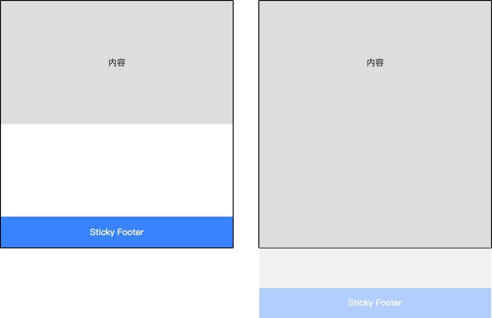

# 需求
&emsp;页脚附着页底或浏览器可视域底部.


# 实现
```html
<div class="wrapper">
	<div class="content"></div>
	<div class="footer"></div>
</div>
```
## Absolute
```less
@footer-height: 25px;

html,body{
  height: 100%;
}
.wrapper{
  min-height: 100%;
  position: relative;
  box-sizing: border-box;
  padding-bottom: @footer-height;
}
.footer{
  position: absolute;
  bottom: 0;
  height: @footer-height;
}
```
## calc
```less
@footer-height: 25px;

.wrapper{
  min-height: calc(100vh - @footer-height);
}
.footer{
  height: @footer-height;
}
```
calc的用法？
vh单位的用法？
## table
```
html, body{
  height: 100%;
}
.wrapper{
  display: table;
  min-height: 100%;
  width: 100%;
}
.footer{
  display: table-row;
  height: 100%;
}
```
`display:table`及相关布局的玩法？
## Flexbox
```
html{
  height:100%;
}
body{
  min-height: 100%;
  display: flex;
  flex-direction: column;
}
.content{
  flex: 1;
}
```
flexbox？
